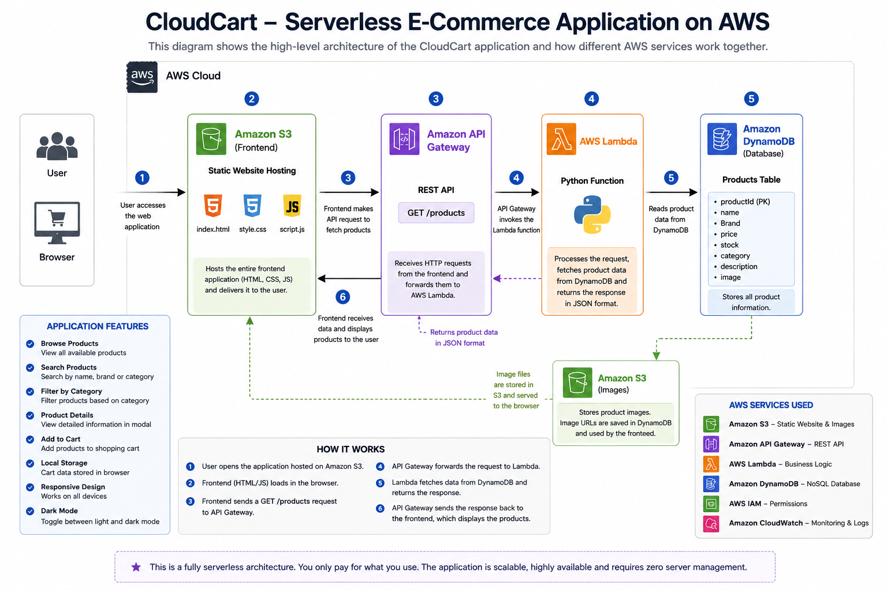

#  Serverless E-Commerce Website on AWS

A fully serverless e-commerce web application built using AWS services. The project demonstrates how to build a scalable, cost-effective online store without managing traditional servers.

---

## Key Highlights

- Built a fully serverless web application on AWS
- Hosted frontend using Amazon S3 Static Website Hosting
- Developed REST APIs using API Gateway and AWS Lambda
- Stored product data in Amazon DynamoDB
- Implemented IAM roles following least-privilege principles
- Monitored backend execution using Amazon CloudWatch

##  Features

- Product catalog
- Search products
- Product details popup
- Shopping cart
- Responsive UI
- Serverless backend
- REST API using API Gateway
- AWS Lambda business logic
- DynamoDB product database
- CloudWatch logging

---

# Architecture

---

# AWS Services Used

| Service | Purpose |
|----------|----------|
| Amazon S3 | Static Website Hosting |
| API Gateway | REST API |
| AWS Lambda | Backend Logic |
| DynamoDB | Product Database |
| IAM | Secure Permissions |
| CloudWatch | Logging & Monitoring |

---

# Technologies

- HTML5
- CSS3
- JavaScript
- AWS Lambda
- Amazon S3
- API Gateway
- DynamoDB
- IAM
- CloudWatch

---
## Project Status

 This project is currently under active development.

Completed:
- Responsive frontend
- Product catalog
- Search functionality
- Shopping cart
- Serverless backend integration
- AWS deployment

Upcoming:
- UI improvements
- Additional product features
- Final screenshots
- Live demo updates

---
# Deployment

### Frontend

Hosted on Amazon S3 Static Website Hosting.

### Backend

- API Gateway
- AWS Lambda
- DynamoDB

---
## Live Demo

Hosted on Amazon S3 Static Website Hosting

Website: http://prajwal-mm-ecommerce-images.s3-website.ap-south-1.amazonaws.com

---
# Learning Outcomes

- Built a complete serverless web application
- Integrated frontend with REST APIs
- Managed product data using DynamoDB
- Implemented AWS IAM permissions
- Hosted a static website on Amazon S3
- Monitored backend using CloudWatch

---

# Future Improvements

- User Authentication (Amazon Cognito)
- Secure Payments
- Order History
- Wishlist
- Admin Dashboard
- Product Images from S3
- Email Notifications using Amazon SES

---

# Author

**Prajwal M M**

Master of Computer Applications

AWS Cloud Enthusiast
